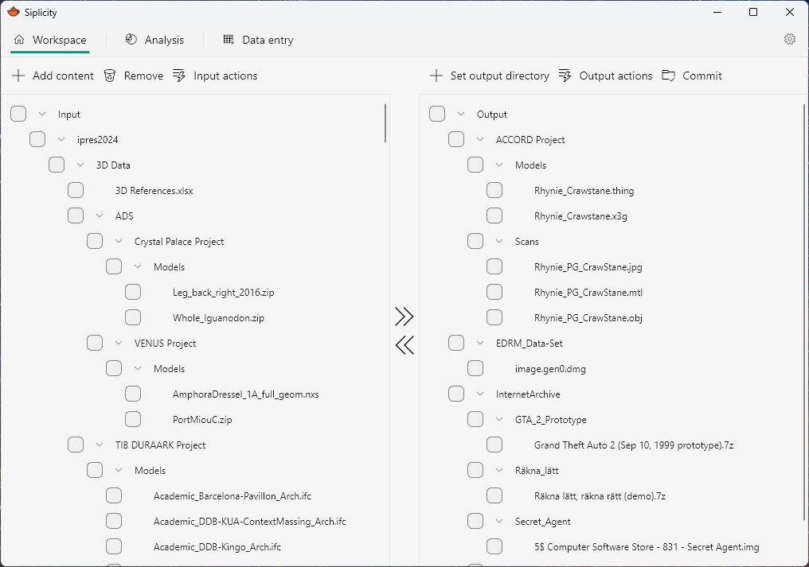

+++
title = "About"
date = 2024-08-07T12:00:00+10:00
draft = false
+++

# Siplicity
## Makes transferring digital files simple
> Explore, select, arrange, describe, and package digital files for transfer.

### Features

- Format identification
- Duplicate detection
- Checksum calculation and verification
- Metadata import
- Pattern based file renaming
- Pattern based filtering and file selection
- Output standards compliant metadata and packages
- Audit logs
- Client-server architecture for local and cloud deployment

### Get in touch

Siplicity is in active development. It's developed by [Richard Lehane](https://richardlehane.me). I'm planning for an early access release in late 2024 and a version one in early 2025.

If you'd like to discuss a use case, or have a question, please drop me a line at [richard.lehane@gmail.com](mailto:richard.lehane@gmail.com).

