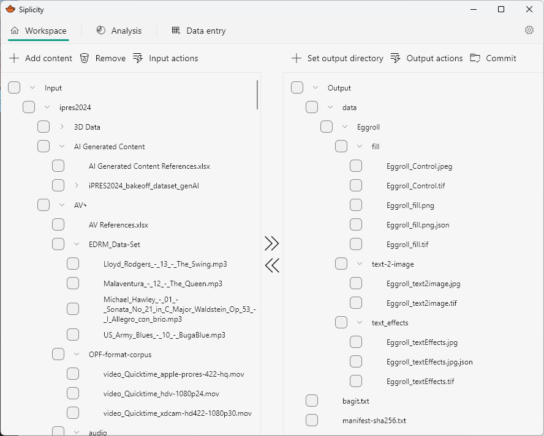
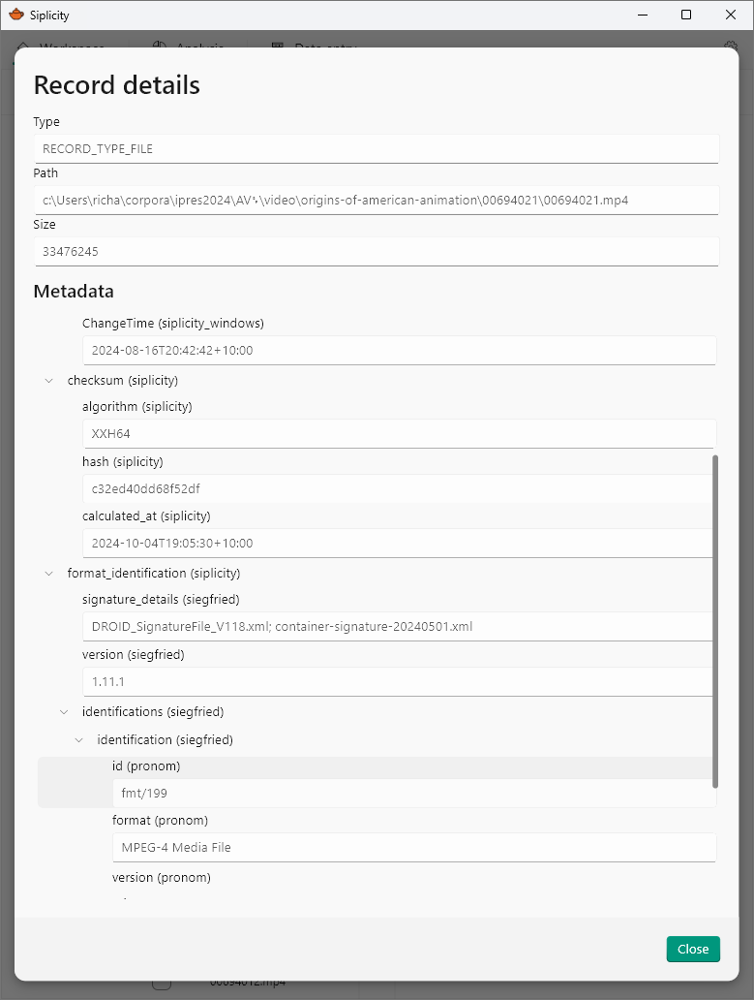
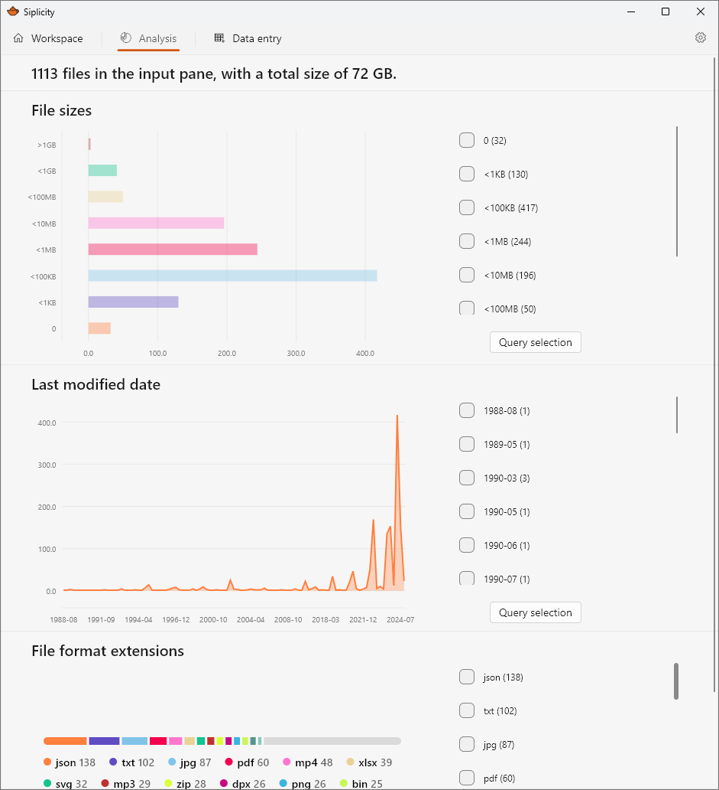

+++
title = "Screenshots"
date = 2024-10-04T12:00:00+10:00
draft = false
+++

# Screenshots
## Workspace Pane

The workspace pane is where you select, structure, describe digital content and export to your preferred targets.

## Details view

Within the workspace pane you can select and view the details for particular records. Siplicity's metadata model allows for the capture of arbitrarily deeply nested metadata structures. This means, for example, that you can capture the time a checksum was performed, along with the algorithm.

## Analysis pane

The analysis pane provides visualisations of file sizes, dates, and file extensions. Running actions such as siegfried identification or checksums produces additional reports on file formats and duplicates. Each analysis links to queries back to the workspace pane allowing you, for example, to quickly identify and remove zero-byte files or duplicates.

